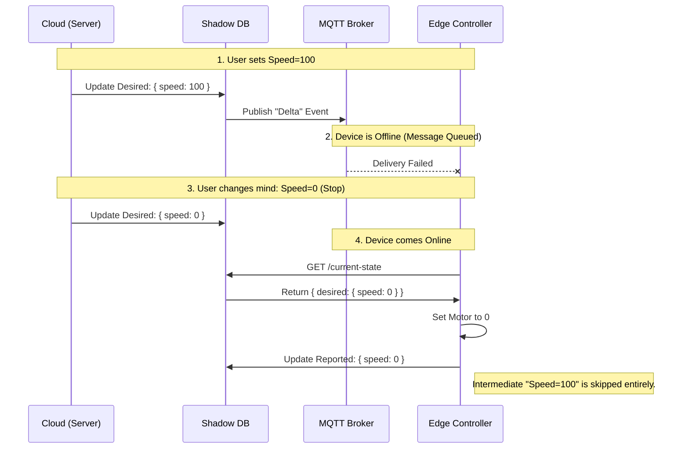

# interview-prep-prioritized-queue

To install dependencies:

```bash
bun install
```

To run:

```bash
bun run index.ts
```

This project was created using `bun init` in bun v1.3.9. [Bun](https://bun.com) is a fast all-in-one JavaScript runtime.


Here is the complete study guide in Markdown.

---

# Distributed Setpoint Controller & Priority Queue

**Theme:** Reliability, Concurrency, and Distributed Systems.

## Part 1: The Coding Challenge

**Prompt:** Implement a thread-safe "Command Queue" with a priority mechanism.

* **High Priority:** `EMERGENCY_SHUTDOWN` (Must be processed immediately).
* **Normal Priority:** `SET_SPEED`, `UPDATE_CONFIG` (Processed FIFO, after High Priority).

### The Solution: Multi-Level Queue (Buckets)

**Why this approach?**
Instead of a complex Binary Heap (), we use two separate arrays. This is "stupid simple," easier to debug, and offers  insertion time, which is critical for high-throughput systems.

```typescript
// src/command-queue.ts

/**
 * Command Priority Levels
 */
enum CommandPriority {
  HIGH = 1,   // Emergency
  NORMAL = 2, // Routine
}

interface Command {
  id: string;
  type: string;
  payload: Record<string, any>;
  priority: CommandPriority;
}

class CommandQueue {
  // Two separate queues allow O(1) categorization
  private _highPriority: Command[] = [];
  private _normalPriority: Command[] = [];

  /**
   * Enqueue
   * Adds command to the correct bucket.
   * Complexity: O(1)
   */
  public enqueue(command: Command): void {
    if (command.priority === CommandPriority.HIGH) {
      this._highPriority.push(command);
    } else {
      this._normalPriority.push(command);
    }
  }

  /**
   * Dequeue
   * strictly drains HIGH priority before touching NORMAL.
   * Complexity: O(N) due to Array.shift() re-indexing.
   * (In C++/Go, we would use a Linked List for O(1)).
   */
  public dequeue(): Command | null {
    // 1. Always check High Priority first
    if (this._highPriority.length > 0) {
      return this._highPriority.shift() || null;
    }

    // 2. Only if High is empty, check Normal
    if (this._normalPriority.length > 0) {
      return this._normalPriority.shift() || null;
    }

    return null;
  }

  public isEmpty(): boolean {
    return this._highPriority.length === 0 && this._normalPriority.length === 0;
  }
}

// --- Usage Example ---
const queue = new CommandQueue();

queue.enqueue({ id: "1", type: "SET_SPEED", priority: CommandPriority.NORMAL, payload: {} });
queue.enqueue({ id: "2", type: "UPDATE_CONFIG", priority: CommandPriority.NORMAL, payload: {} });
queue.enqueue({ id: "3", type: "EMERGENCY_STOP", priority: CommandPriority.HIGH, payload: {} });

console.log(queue.dequeue()?.type); // Output: EMERGENCY_STOP
console.log(queue.dequeue()?.type); // Output: SET_SPEED

```

Heap example:
```typescript
// src/heap-queue.ts

enum CommandPriority {
  HIGH = 10,  // Higher number = Higher priority in Max Heap
  NORMAL = 1,
}

interface Command {
  id: string;
  type: string;
  priority: CommandPriority;
  insertionOrder: number; // Needed to maintain stable FIFO for equal priorities
}

class PriorityQueue {
  // The single array that holds everything
  private _heap: Command[] = [];
  private _counter: number = 0; // Monotonic counter for stable ordering

  /**
   * Parent Index: Math.floor((i - 1) / 2)
   * Left Child:   2 * i + 1
   * Right Child:  2 * i + 2
   */

  public enqueue(command: Command): void {
    // Tag with insertion order to guarantee FIFO for same-priority items
    command.insertionOrder = this._counter++;
    
    // 1. Push to end (Leaf)
    this._heap.push(command);
    
    // 2. Bubble Up (Restore Heap Property)
    this._bubbleUp(this._heap.length - 1);
  }

  public dequeue(): Command | null {
    if (this._heap.length === 0) return null;
    if (this._heap.length === 1) return this._heap.pop() || null;

    // 1. Capture the Root (Highest Priority)
    const root = this._heap[0];

    // 2. Move last leaf to Root
    this._heap[0] = this._heap.pop()!;

    // 3. Bubble Down (Restore Heap Property)
    this._bubbleDown(0);

    return root;
  }

  private _bubbleUp(index: number): void {
    while (index > 0) {
      const parentIdx = Math.floor((index - 1) / 2);
      
      if (this._shouldSwap(index, parentIdx)) {
        this._swap(index, parentIdx);
        index = parentIdx;
      } else {
        break;
      }
    }
  }

  private _bubbleDown(index: number): void {
    const length = this._heap.length;
    
    while (true) {
      let swapIdx = -1;
      const leftIdx = 2 * index + 1;
      const rightIdx = 2 * index + 2;

      // Check Left
      if (leftIdx < length) {
        if (this._shouldSwap(leftIdx, index)) {
          swapIdx = leftIdx;
        }
      }

      // Check Right
      if (rightIdx < length) {
        // If right is even bigger than left (or current best swap), take right
        const compareIdx = swapIdx === -1 ? index : swapIdx;
        if (this._shouldSwap(rightIdx, compareIdx)) {
          swapIdx = rightIdx;
        }
      }

      if (swapIdx === -1) break;

      this._swap(index, swapIdx);
      index = swapIdx;
    }
  }

  /**
   * Comparison Logic
   * Returns true if 'a' has higher priority than 'b'.
   * If priorities are equal, checks insertion order (FIFO).
   */
  private _shouldSwap(idxA: number, idxB: number): boolean {
    const a = this._heap[idxA];
    const b = this._heap[idxB];

    if (a.priority > b.priority) return true;
    if (a.priority < b.priority) return false;

    // Priorities are equal -> Lower insertionOrder comes first (FIFO)
    // Note: Since we are a MAX heap, "higher value" bubbles up.
    // For timestamp/order, "smaller value" (older) is better.
    // So we swap if A is OLDER (smaller index) than B.
    return a.insertionOrder < b.insertionOrder; 
  }

  private _swap(i: number, j: number): void {
    [this._heap[i], this._heap[j]] = [this._heap[j], this._heap[i]];
  }
}
```

---

## Part 2: The System Design

**Prompt:** Design a system to send "Setpoints" (operational instructions) to thousands of remote controllers.

* **Constraint 1:** Network is unreliable (controllers go offline).
* **Constraint 2:** Commands must be idempotent (executing twice shouldn't break anything).

### The Solution: Device Shadows & Eventual Consistency

Directly sending commands (Imperative) is brittle. Instead, we sync state (Declarative).

#### Core Concepts

1. **Device Shadow (Digital Twin):** A JSON document in the cloud representing the *Desired State* vs the *Reported State*.
2. **The Delta:** The difference between Desired and Reported. The device only needs to know the *Delta* to correct itself.
3. **Idempotency Keys:** Every critical command has a UUID. The device stores a history of executed UUIDs to prevent duplicates.

#### Architecture Diagram



---

## Part 3: The Conversation (Leveling Up)

*How to discuss this design like a Pro.*

### 🟢 Level 1: The Junior Engineer

*Focus: "Make it work."*

* **Approach:** "We use HTTP POST requests to the device IP address."
* **The Flaw:** Devices are often behind firewalls (NAT) or offline. You can't just `curl` a machine in a factory.
* **Junior's Fix:** "Okay, the device polls the server every 5 seconds?"
* **Result:** Massive server load (DDOS yourself) and wasted data.

### 🟡 Level 2: The Senior Engineer

*Focus: "Make it reliable."*

* **Approach:** "We use **MQTT** (Pub/Sub) for a persistent connection. We use **QoS 1** (Quality of Service) to ensure 'At Least Once' delivery."
* **Addressing Duplicates:** "Since MQTT might deliver twice, we add a UUID to every message. The device checks a local database: `if (exists(uuid)) return;`."
* **The Flaw:** This relies on a **Queue**. If the device is offline for 4 hours, when it reconnects, it receives 4 hours of stale commands (Speed 100 -> Speed 200 -> Stop). The machine goes crazy trying to execute old history.

### 🔴 Level 3: The Staff Architect

*Focus: "Make it correct (State Convergence)."*

* **Approach:** "Queues are dangerous for state. We use the **Device Shadow** pattern."
* **The Logic:** "When a device wakes up, it shouldn't ask 'What happened while I was gone?' It should ask 'What is the truth right now?'"
* **The Mechanism:**
1. Server updates `Desired State` in DB.
2. Device wakes up and pulls the `Desired State`.
3. Device ignores all intermediate history and jumps straight to the final result.


* **Exception:** "For *High Priority* commands like `EMERGENCY_STOP`, we bypass the Shadow and use the Priority Queue from Part 1, because safety overrides consistency."